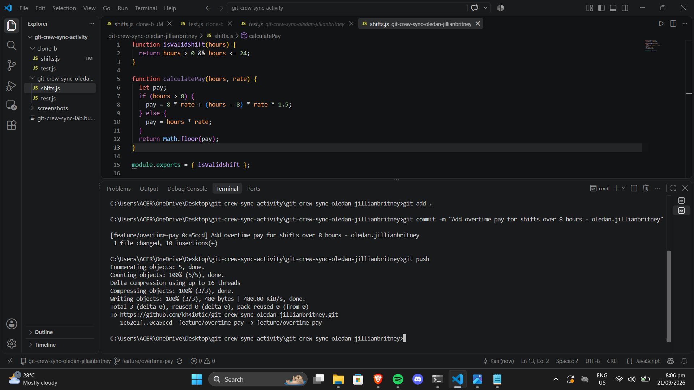
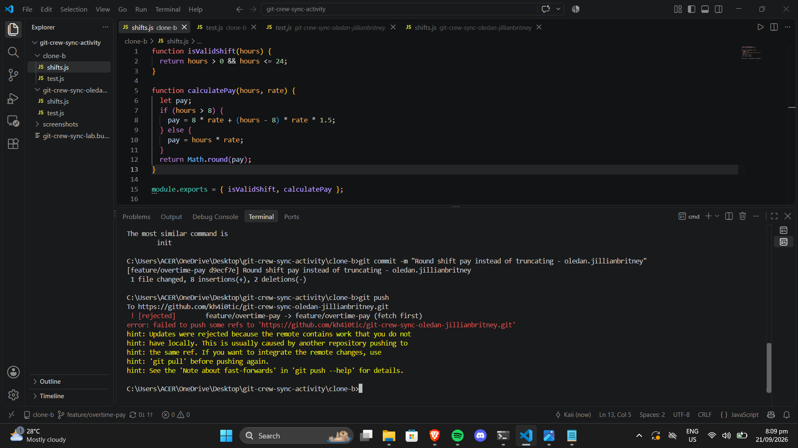
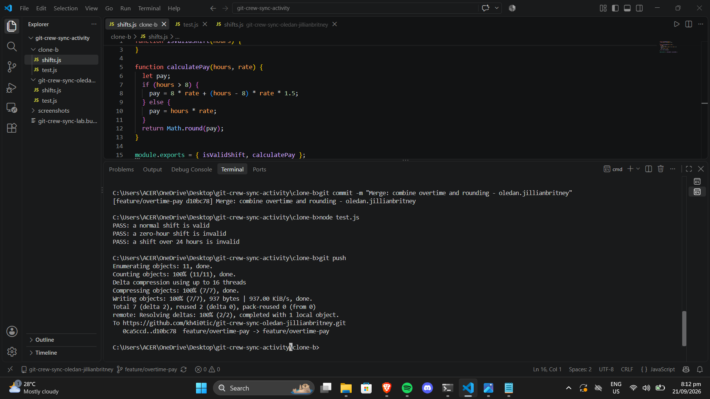
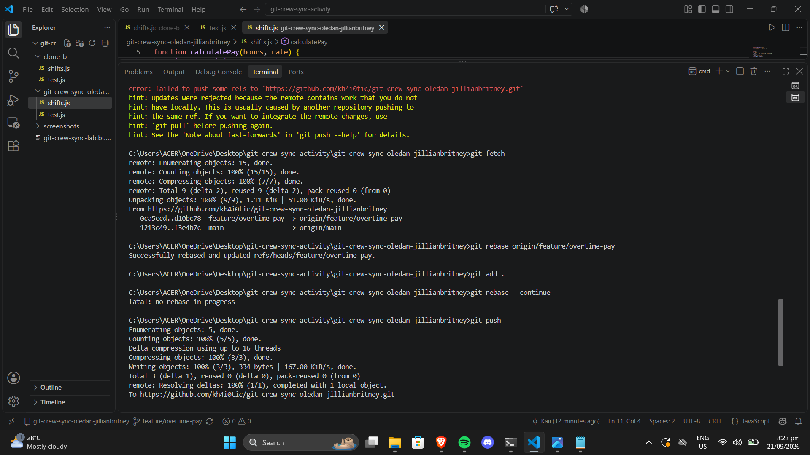
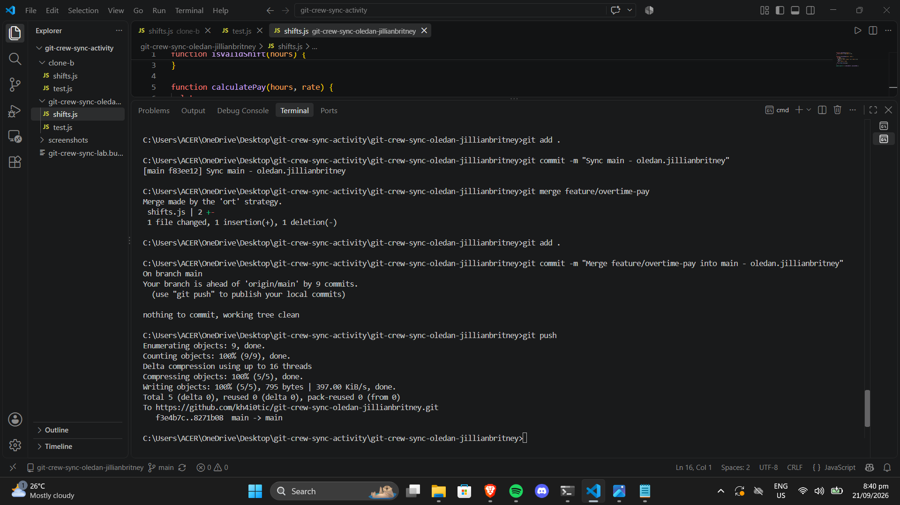
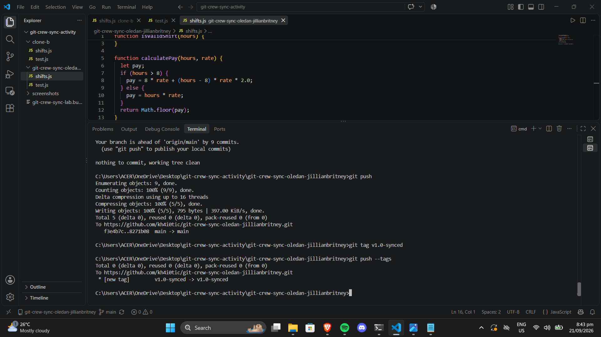

# Git Crew Sync Workflow

## Task 1: Push a change from Clone A

Added calculatePay with overtime (time-and-a-half over 8 hours) and Math.floor. Committed and pushed from Clone A.

## Task 2: Diverge from Clone B — rejected

Made a different change (Math.round instead of Math.floor) in Clone B without fetching. Push was rejected because Clone A's commit was already on the remote.

## Task 3: Reconcile with a merge

Fetched and merged origin/feature/overtime-pay in Clone B. Resolved the conflict by keeping Math.round (both behaviors survive: overtime + rounding). Tests pass. Pushed.

## Task 4: Diverge again — reconcile with rebase

Made another change in Clone A without fetching. Push rejected again. Resolved with git fetch + git rebase. Resolved conflict, continued rebase, pushed.

## Task 5: Merge into main

Merged feature/overtime-pay into main and pushed.

## Task 6: Tag and document

Tagged the final commit v1.0-synced and pushed tags.

   

What did the rejected push error message tell you, and why did it happen?
- The error said ! [rejected] (non-fast-forward) and hinted that my local branch was behind the remote. It happened because Clone A had already pushed a commit to feature/overtime-pay on GitHub, and Clone B didn't know about it. Git refuses to let you push a commit that would overwrite someone else's work, it would lose Clone A's changes.

What's the actual difference between how you resolved Task 3 (merge) vs Task 4 (rebase)?
- For task 3 (merge), I ran git merge origin/feature/overtime-pay, which created a new merge commit that combines both histories. The result is a "Y" shape in the commit graph two lines of work join at one point.
For task 4 (rebase) I ran git rebase origin/feature/overtime-pay, which replayed my commit on top of the remote's latest. No merge commit is created the history stays linear, as if I had made my change after the remote's change. Same conflict to resolve either way; the difference is the resulting history shape.

What one habit would have avoided both rejected pushes in this lab?
- git pull (or git fetch) before every git push. If I had fetched before pushing in Task 2 and Task 4, I would have seen the remote was ahead and resolved the conflict locally first, so the push would have succeeded the first time.

Which approach - merge or rebase - would you default to on a shared team branch, and why?
- Merge. Rebase rewrites commit history. If someone else has already pulled your commits, rebasing and force-pushing would break their local copy. Merge is "safe",it never rewrites existing commits, so no one else's work gets invalidated. You only rebase commits that are yours and unpushed.
